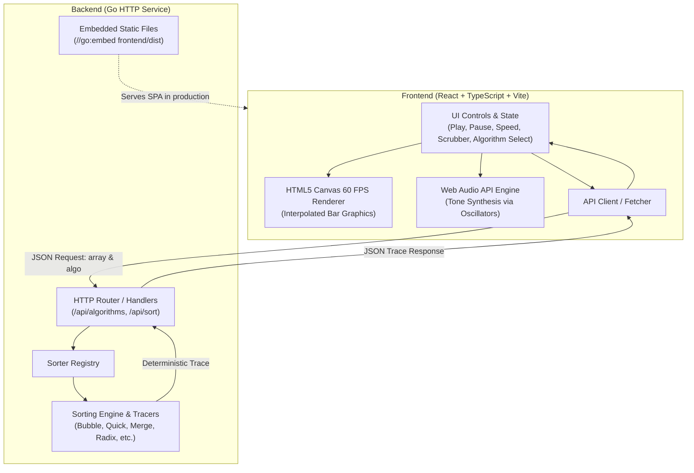

# SortPulse Architecture Specification

**SortPulse** is an interactive, high-performance sorting algorithm visualization lab. It features a Go backend engine that executes sorting algorithms and compiles deterministic step traces, paired with a modern React + TypeScript frontend that renders animations on an HTML5 Canvas with video-style playback controls and synthesized audio feedback.

---

## 1. System Overview



---

## 2. Core Concepts: The Timeline Trace Model

Instead of relying on fragile live network streaming for every single array swap, SortPulse uses a **deterministic timeline trace model**:

1. **Client sends** an input array and chosen algorithm ID to `/api/sort`.
2. **Go backend executes** the algorithm in memory, recording an immutable log of discrete `Step` events (`compare`, `swap`, `overwrite`, `pivot`, `mark_sorted`).
3. **Frontend receives** the entire `Trace` payload (typically a few kilobytes to megabytes for arrays of 20–200 items).
4. **React + Canvas Player** treats the trace like a video timeline:
   - **Play / Pause / Speed Slider** (1x to 50x)
   - **Interactive Scrubber** (jump to any point in the sort instantly)
   - **Step Forward / Step Backward** for fine-grained algorithmic analysis

---

## 3. Data Contracts & JSON Specifications

### 3.1 Step Types (`StepType`)

| Type | Description | Target Indices | Values |
| :--- | :--- | :--- | :--- |
| `compare` | Inspecting two elements without modifying array | `[i, j]` | — |
| `swap` | Swapping elements at two indices | `[i, j]` | — |
| `overwrite` | Writing a specific value at an index (Merge / Counting sort) | `[i]` | `[val]` |
| `pivot` | Designating a partition pivot (e.g. Quicksort) | `[i]` | — |
| `mark_sorted`| Marking an element as placed in its final position | `[i]` | — |

### 3.2 Step Schema

```json
{
  "type": "compare",
  "indices": [4, 5],
  "values": [],
  "description": "Comparing array[4] (23) with array[5] (12)"
}
```

### 3.3 Algorithm Metadata Schema (`GET /api/algorithms`)

```json
[
  {
    "id": "bubble",
    "name": "Bubble Sort",
    "category": "comparison",
    "best_time": "O(n)",
    "average_time": "O(n²)",
    "worst_time": "O(n²)",
    "space_complexity": "O(1)",
    "stable": true,
    "description": "Repeatedly steps through the list, compares adjacent elements, and swaps them if they are in the wrong order."
  }
]
```

### 3.4 Sort Request & Response (`POST /api/sort`)

**Request Payload:**
```json
{
  "algorithm": "quick",
  "array": [50, 23, 9, 18, 61, 32]
}
```

**Response Payload:**
```json
{
  "algorithm": "quick",
  "initial_array": [50, 23, 9, 18, 61, 32],
  "final_array": [9, 18, 23, 32, 50, 61],
  "steps": [
    { "type": "pivot", "indices": [5], "description": "Selected 32 as partition pivot" },
    { "type": "compare", "indices": [0, 5], "description": "Comparing 50 with pivot 32" }
  ],
  "total_steps": 14,
  "comparisons": 8,
  "swaps": 4,
  "execution_time_us": 45
}
```

---

## 4. Backend Architecture (Go)

### Recommended Package Layout

```
sortpulse/
├── cmd/
│   └── server/
│       └── main.go          # HTTP server bootstrap, routing, flags
├── internal/
│   ├── sorter/
│   │   ├── model.go         # Step, Trace, AlgorithmMeta definitions
│   │   ├── registry.go      # Algorithm registry map & lookups
│   │   ├── bubble.go        # Bubble sort implementation
│   │   ├── insertion.go     # Insertion sort
│   │   ├── selection.go     # Selection sort
│   │   ├── quick.go         # Quick sort (Lomuto or Hoare)
│   │   ├── merge.go         # Merge sort (in-place trace recording)
│   │   ├── heap.go          # Heap sort
│   │   ├── counting.go      # Counting sort (non-comparison)
│   │   └── radix.go         # Radix sort (LSD)
│   └── api/
│       ├── handlers.go      # /api/algorithms and /api/sort endpoints
│       └── cors.go          # CORS middleware for local Vite dev
├── frontend/                # React Vite TypeScript app
├── go.mod
├── ARCHITECTURE.md
├── PLAN.md
└── README.md
```

### Trace Recording Pattern in Go

Each sorting algorithm works on a copy of the input slice and uses helper tracer methods:

```go
type Tracer struct {
    arr   []int
    steps []Step
    comps int
    swaps int
}

func (t *Tracer) Compare(i, j int, desc string) bool {
    t.comps++
    t.steps = append(t.steps, Step{
        Type:        StepCompare,
        Indices:     []int{i, j},
        Description: desc,
    })
    return t.arr[i] > t.arr[j]
}

func (t *Tracer) Swap(i, j int, desc string) {
    t.swaps++
    t.arr[i], t.arr[j] = t.arr[j], t.arr[i]
    t.steps = append(t.steps, Step{
        Type:        StepSwap,
        Indices:     []int{i, j},
        Description: desc,
    })
}
```

---

## 5. Frontend Architecture (React + TypeScript)

### Component Tree

```
App
├── Header (Title, GitHub link, Mute toggle)
├── ControlBar
│   ├── AlgorithmSelector (Dropdown + category tabs)
│   ├── ArrayControls (Array size slider, Shuffle, Presets: random, reverse, nearly-sorted)
│   └── PlaybackControls (Play/Pause, Step Back, Step Forward, Speed slider, Reset)
├── Visualizer
│   ├── CanvasView (HTML5 Canvas element rendering vertical bars)
│   └── CalloutBanner (Current step description & active state)
├── TimelineScrubber (Interactive range input tracking currentStep / totalSteps)
└── MetricsPanel (Comparisons, Swaps, Elapsed Time, Time/Space Complexity badges)
```

### High-Performance Canvas Rendering

- **Avoid React re-rendering every canvas pixel.**
- Keep the array state in a `useRef` or canvas state controller.
- Use `requestAnimationFrame` for smooth 60 FPS animations.
- Use bar colors to communicate status:
  - 🔵 **Default / Unsorted**: Muted blue or slate
  - 🟡 **Comparing**: Bright amber / yellow
  - 🔴 **Swapping / Writing**: Coral / crimson
  - 🟣 **Pivot**: Purple
  - 🟢 **Sorted**: Emerald green

---

## 6. Audio Engine Design (Web Audio API)

- **Mapping Pitch to Value**:
  Normalize array element values from `min` to `max` into an audible frequency range (e.g. **120 Hz to 880 Hz**).
- **Oscillator Type**: Use `'triangle'` or `'sine'` waveform for pleasing, non-piercing arcade chimes.
- **Envelope Generator**: Apply an exponential gain ramp down (e.g. 20–50ms duration) on comparison/swap events to avoid audio clipping or popping.
- **Mute Control**: AudioContext master gain node toggled by the user.

---

## 7. Single Binary Deployment Strategy

In production, Go can compile and serve the entire React build without requiring Node.js on the production host:

```go
//go:embed frontend/dist/*
var staticFS embed.FS
```

1. Build frontend: `cd frontend && npm run build`
2. Build Go: `go build -o sortpulse ./cmd/server`
3. Running `./sortpulse` automatically serves the React UI at `http://localhost:8080` and the API at `/api/*`.
